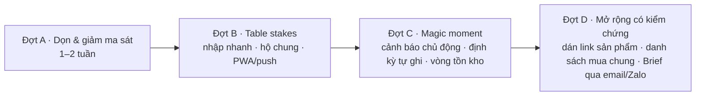

# Rà soát sản phẩm FamAgent & so sánh thị trường → định hướng phát triển

Ngày 24/09/2026 · Nguồn: code `main@6a4c85a`, [SPEC_V2](../../docs/SPEC_V2_FAMILY_OS.md), [plan UX redesign](../260924-1036-ux-redesign/plan.md), [báo cáo thị trường](researcher-260924-1358-family-os-market-comparison.md).
**Giới hạn:** chưa xem UI chạy thật (lệnh build demo bị chặn trong phiên này) → phần UI/UX dựa trên đọc code + mockup; cần một vòng xem màn hình 375px/desktop để xác nhận.

## 0. Contract

- **Outcome:** danh sách có bằng chứng: tính năng thừa, chưa tối ưu, UI/UX kém + lộ trình ưu tiên để đưa vào `/ak:plan`.
- **Constraints:** giữ IA 5 mục (Spec v2); rules-first, LLM khi cần; thị trường VN; mục tiêu gần: thử kín 5–8 gia đình (Đợt 5).
- **Non-goals:** không code trong bước này; không đổi định vị Family OS; không làm app native.
- **Acceptance:** mỗi phát hiện có file/commit làm chứng; lộ trình chia đợt, mỗi đợt có tiêu chí đo.

## 1. Hiện trạng (tóm tắt)

| Mục | Có gì | Ghi chú |
|---|---|---|
| Onboarding | 18 câu nền + câu theo từng con + 2 nhánh sâu (8 câu chăm con, 6 câu tài chính) + đánh giá cuối → **bắt buộc** tạo tài khoản | `lib/onboarding/questions.ts` — tối đa ~35 màn trước khi thấy giá trị |
| Home | Cần chú ý · Việc hôm nay · Tiền tháng này · Mua sắm · FamAgent nhận thấy | tải phía client, 2 nhịp (hồ sơ → tiền/mua) `family-brief.tsx:35-49` |
| Tiền | Sổ kiểu Excel, bảng Tháng, ngân sách, định kỳ, mục tiêu, **6 phương pháp** quản lý tiền, FinHealth check | nhập tay 100% |
| Mua sắm | 4 tab (Đang theo dõi · Tìm & so sánh · Đã mua · Đã lưu) + `/compare` + `/products/[slug]` | catalog chỉ bỉm, dữ liệu demo/staging |
| Trợ lý | Coordinator: câu hỏi tiền (quy tắc) + pipeline mua bỉm | chat **không ghi** được giao dịch |
| Gia đình | form 5 phần (Hộ · Bé · Ưu tiên mua · Thiết bị · Ghi nhớ) + tài khoản + **6 phương pháp nuôi dạy** + Nurturing Care check | |
| Nền | 29 bảng, RLS theo `user_id`; song song đường localStorage/cloud | **không có** household/partner, PWA, push, email brief |

## 2. So với thị trường (rút gọn)

| Năng lực | Cozi/FamilyWall | Ohai | Monarch/YNAB | Money Lover/MISA | FamAgent |
|---|---|---|---|---|---|
| Chia sẻ vợ/chồng | ✓ lõi | ✓ | ✓ | ✓ (MISA) | ✗ |
| Lịch/việc/danh sách chung | ✓ lõi | ✓ | – | – | ✗ |
| Nhập chi tiêu nhanh (giọng nói/ảnh/bank) | – | – | bank sync | giọng nói, quét hóa đơn, liên kết NH | ✗ nhập tay |
| Thông báo/nhắc | ✓ | ✓ | ✓ | ✓ | ✗ |
| Mobile app/PWA | ✓ | ✓ | ✓ | ✓ | web responsive |
| Brief liên module Tiền + Mua + Con | – | một phần | – | – | **✓ khác biệt** |
| Agent mua sắm có lọc cứng + ghi sổ + tồn kho | – | – | – | – | **✓ khác biệt** |
| Kiểm tra sức khỏe tài chính có cấu trúc | – | – | – | – | **✓ khác biệt** |

**Bài học:** khác biệt thật = *nối* Tiền ↔ Mua sắm ↔ Con. Nhưng thiếu 4 “table stakes” (chia sẻ, nhập nhanh, nhắc, cài như app) → magic moment của spec (“phát hiện trước khi tôi nhớ ra”) **không thể xảy ra** nếu người dùng phải tự mở app và tự gõ từng khoản.

## 3. Tính năng thừa / vượt phạm vi

| # | Phát hiện | Bằng chứng | Đề xuất |
|---|---|---|---|
| T1 | **Quá tải “phương pháp”**: 6 cách quản lý tiền + 6 cách nuôi dạy + 2 bài kiểm tra sâu + đánh giá onboarding. Người dùng phải chọn trong 12 tên riêng (Kakeibo, RIE, Baby Steps…) | `lib/money/frameworks.ts`, `lib/care/methods.ts`, commit `211542f`, `30728c5` | Giữ quyền chọn (quyết định đã chốt) nhưng **mặc định gợi ý 1** dựa trên đánh giá, hiện “Đổi phương pháp” gọn; rút danh sách hiển thị còn 3 mỗi loại (Tiền: 6 hũ, 50/30/20, ưu tiên trả nợ; Con: theo độ tuổi) |
| T2 | **Mảng Chăm con vượt MVP**: Spec v2 §33 MVP = Finance + Shopping; Care coordination là module *sau MVP* (§24) | spec §24, §33 | Đóng băng mở rộng Care; chỉ giữ “mẹo theo tuổi” nuôi Việc hôm nay. Không thêm câu hỏi care mới |
| T3 | Phần **“Thiết bị trong nhà”** (để chọn nước giặt) — danh mục chưa tồn tại | `family-editor.tsx:111` | Ẩn tới khi có danh mục thứ 2 |
| T4 | **“Ưu tiên mua sắm”** ở Gia đình trùng onboarding/hồ sơ chat | `family-editor.tsx:102` | Gộp vào thẻ bé / hỏi trong luồng mua |
| T5 | **Đã lưu** vs **Đang theo dõi** vs **Đã mua** — 3 danh sách sản phẩm cạnh nhau | `shopping/page.tsx:12` | 2 tab: *Cần mua* (theo dõi + đã lưu) · *Đã mua*; tìm kiếm là thanh trên cùng, không phải tab |
| T6 | **Đường localStorage cho khách** trong khi đăng ký đã bắt buộc (middleware) | `lib/experience/storage.ts` vs `cloud.ts`; logic nạp/lưu hồ sơ lặp ở ≥3 component | Giữ localStorage chỉ cho chế độ demo, gom qua 1 `profile-store` duy nhất; bỏ nhánh `cloudEnabled ?` rải rác |
| T7 | Home hiển thị “Gần đây: <tên cuộc trò chuyện>” & “Đang tư vấn cho” | `family-brief.tsx:74-77` | Bỏ; Home chỉ nói điều cần làm |

## 4. Chưa tối ưu (chức năng)

| # | Vấn đề | Tác động | Đề xuất |
|---|---|---|---|
| O1 | **Nhập chi tiêu chỉ qua bảng** — chat không ghi được “ăn sáng 45k” dù đã có `parseVnd` | ma sát lớn nhất; MISA/Money Lover thắng nhờ nhập nhanh | Thanh nhập nhanh 1 dòng ở Home + Tiền + Trợ lý: “cafe 45k hôm qua” → tách số tiền/ngày/nhóm (quy tắc trước, LLM dự phòng) → xác nhận 1 chạm |
| O2 | **Không có hộ gia đình chung**: mọi bảng theo `user_id` | Family OS mà 1 người dùng; vợ/chồng không cùng sổ | `households` + `household_members` + mời bằng link; RLS theo household; scope Riêng/Chung (spec §32) |
| O3 | **Không nhắc chủ động** (không push/email/Zalo); Brief tuần chỉ trong app | không có magic moment, retention phụ thuộc thói quen mở app | PWA (manifest + service worker) + Web Push cho 3 loại: sắp hết đồ, chi vượt nhịp, hóa đơn đến hạn. Email/Zalo sau |
| O4 | Khoản **định kỳ không tự ghi** vào sổ khi đến hạn | vẫn phải gõ lại tiền nhà, điện… | Thẻ “Hôm nay đến hạn: Tiền nhà 6tr — Ghi · Bỏ qua” |
| O5 | Ước tính tồn kho dùng tốc độ mặc định, **không có vòng xác nhận** | “còn ~N ngày” sai dần, mất tin | Hỏi 1 chạm “Còn bỉm không? Còn nhiều/ít/hết” → hiệu chỉnh rate |
| O6 | **Tự gieo kế hoạch chi + Quỹ dự phòng** từ onboarding một cách im lặng | `money-page.tsx:50-58` — người dùng thấy số lạ không rõ nguồn | Hiện thẻ “Đã đặt từ đánh giá ban đầu · Sửa/Bỏ” |
| O7 | Catalog tự xây (bỉm demo) — chi phí dữ liệu cao, affiliate Shopee/TikTok đang bị ép phí | mở danh mục mới rất chậm | Thử “**dán link sản phẩm**” (Shopee/Lazada/Con Cưng) → FamAgent đọc giá/số miếng, tính giá/miếng, ghi Đã mua, theo dõi tồn. Giữ catalog bỉm cho tư vấn |
| O8 | Home tải phía client, 2 nhịp | chậm trên 4G | Chuyển nạp dữ liệu Home sang server component/1 API `/api/brief` |
| O9 | Không có E2E cho luồng onboarding → Home → Tiền → Mua | rủi ro hồi quy khi dọn T6 | Playwright 3 luồng chính trước khi dọn |

## 5. UI/UX chưa tốt

| # | Vấn đề | Bằng chứng | Đề xuất |
|---|---|---|---|
| U1 | **Onboarding quá dài** trước giá trị + bắt buộc tài khoản ngay sau | ~35 màn tối đa; `questions.ts:98-312` | Lõi 6–7 câu (mục tiêu, gia đình, con: tên/tuổi/cân, thu–chi khoảng) ≤ 90 giây; 2 nhánh sâu chuyển thành thẻ “Làm bài kiểm tra 1 phút” trên Home (progressive profiling) |
| U2 | **Hai hệ thiết kế cùng tồn tại**: tab Tìm & so sánh dùng `container catalog-page/page-heading/button primary`; Gia đình dùng `form-card` đánh số 01–05; các màn khác dùng `app-page/app-card` | `shopping/page.tsx:28`, `family-editor.tsx:82` | Chuyển hết sang `app-*`; một bộ token |
| U3 | **“Cần chú ý” bị lấp bởi việc cài đặt** (chọn phương pháp, đặt kế hoạch…) cạnh cảnh báo thật; Việc hôm nay lại có thẻ mời chọn phương pháp lần nữa | `build-brief.ts`, `daily-tasks.tsx:22` | Tách: *Cần chú ý* chỉ cảnh báo thật (tối đa 3); việc cài đặt gom 1 thẻ “Hoàn thiện hồ sơ 3/5” |
| U4 | Mua sắm mặc định mở **Tìm**, không mở **Đang theo dõi**; bộ lọc cân nặng/size không điền sẵn từ hồ sơ bé; phải bấm “Áp dụng” | `shopping/page.tsx:18,31` | Mặc định tab theo dõi khi có dữ liệu; prefill từ bé đang chọn; lọc tức thì |
| U5 | Trang Tiền: panel phương pháp nằm **trên** tab → sổ bị đẩy xuống; 4 KPI + thanh + panel trước khi thấy nút thêm khoản | `money-page.tsx:70-80` | Thứ tự: KPI gọn → nhập nhanh → sổ; phương pháp thu vào tab “Kế hoạch” |
| U6 | Gia đình là 1 form dài, lưu cả khối | `family-editor.tsx` | Thẻ theo thành viên, sửa tại chỗ, tự lưu có trạng thái “Đã lưu” |
| U7 | Trợ lý: component tên `agent-shopping`, lời chào/chip nghiêng về bỉm | `agent-shopping.tsx` | Chip khởi đầu cân bằng: “Ghi khoản chi”, “Tháng này tiêu bao nhiêu?”, “Mua bỉm cho bé” |
| U8 | Thiếu phản hồi lưu trong onboarding/form | explore report | Trạng thái Đang lưu/Đã lưu thống nhất |

## 6. Hướng đi — 3 phương án

| | A. Mở rộng bề rộng (thêm Lịch/Việc, Care…) | **B. Làm sâu vòng lặp Tiền ↔ Mua ↔ Nhắc (đề xuất)** | C. Thu hẹp thành app sổ chi tiêu |
|---|---|---|---|
| Giả định chính | Người dùng cần “một app cho mọi thứ” | Giá trị = ít phải nhớ; cần dữ liệu vào dễ + nhắc ra đúng lúc | VN cần sổ chi tốt hơn Money Lover |
| Hỏng trước khi | Mỗi module nông → thua Cozi/Money Lover từng mảng | Nhập nhanh vẫn không đủ dễ → sổ trống → brief rỗng | Đụng thẳng MISA/Money Lover (miễn phí, bank sync) |
| Trường hợp xấu | Nợ kỹ thuật + onboarding dài hơn | Phải thêm bank/SMS import sớm hơn dự kiến | Mất khác biệt Family OS |
| Chi phí bỏ | Cao | Thấp (các phần đều tái dùng) | Trung bình |

**Đề xuất B**, khớp Spec v2 §33 (MVP = Finance + Shopping + Brief) và rẻ nhất để bỏ.

## 7. Lộ trình đề xuất

| Đợt | Hạng mục (mã ở trên) | Đo nghiệm thu |
|---|---|---|
| **A · Dọn & giảm ma sát** (thay Đợt 5 hiện tại) | E2E 3 luồng (O9) trước; U1 onboarding lõi; T1 mặc định 1 phương pháp; T2 đóng băng Care; T3–T5, T7; U2 một hệ thiết kế; U3 tách Cần chú ý; U4, U5; O6; T6 gom profile-store | Onboarding ≤ 90 giây median; 0 màn dùng class cũ; E2E xanh; Home ≤ 3 thẻ cảnh báo |
| **B · Table stakes** | O1 nhập nhanh (Home/Tiền/Trợ lý); O2 hộ gia đình + mời vợ/chồng; O3 PWA + Web Push; U6, U7 | ≥ 60% khoản chi nhập qua 1 dòng; ≥ 30% hộ thử có 2 thành viên; cài PWA được trên Android/iOS |
| **C · Magic moment** | Bộ quy tắc cảnh báo (sắp hết, vượt nhịp, đến hạn) → push; O4 định kỳ tự ghi; O5 vòng xác nhận tồn; O8 Home server-side | North-star “việc được giải quyết chủ động”/hộ/tuần; tỉ lệ bấm push → hành động |
| **D · Mở rộng** | O7 dán link sản phẩm; danh sách mua chung (mảnh Planner đầu tiên, table stake của Cozi); Brief tuần qua email → Zalo OA | Chỉ làm khi đợt C đạt ngưỡng giữ chân 4 tuần |

## 8. Rủi ro / câu hỏi mở

1. T1/U1 đi ngược một phần quyết định gần đây (cho chọn phương pháp, thêm câu hỏi sâu) — cần chủ sản phẩm xác nhận hướng “gợi ý 1 + cho đổi” và “hỏi sâu sau”.
2. Đóng băng Care (T2): có giữ Nurturing Care check trên Gia đình không, hay ẩn hẳn?
3. Hộ gia đình (O2) là migration lớn (đổi RLS mọi bảng money_*/purchases) — cần backup + kế hoạch chuyển dữ liệu.
4. iOS Web Push chỉ chạy khi đã “Thêm vào MH chính” (iOS 16.4+) — chấp nhận hay cần email dự phòng sớm?
5. Chưa có dữ liệu người dùng thật/app-store review VN để xác nhận điểm đau — nên phỏng vấn 5–8 gia đình thử kín song song Đợt A.
6. Chưa xem UI chạy thật trong phiên này; cần vòng chụp màn hình để xác nhận U2–U6.
